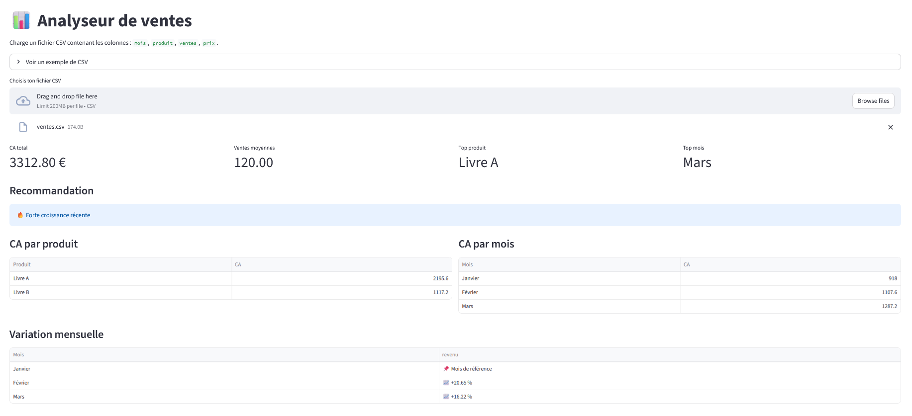
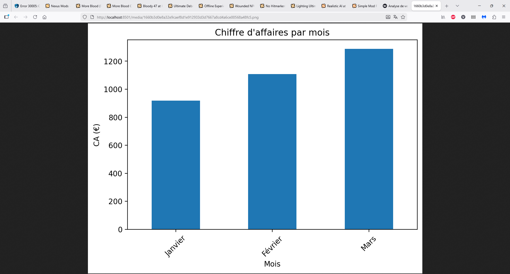
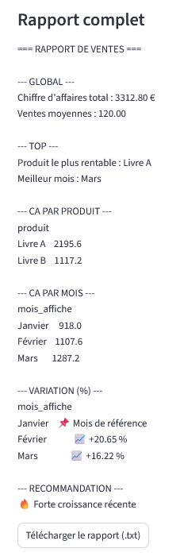

# 📊 Analyseur de ventes


Outil Python permettant d’analyser un fichier de ventes, de générer des indicateurs clés et de produire un rapport automatique.

---

## 🎯 Objectif

Transformer un fichier de données brutes en informations exploitables pour piloter l’activité :

- Suivre le chiffre d’affaires
- Identifier les produits performants
- Analyser les tendances
- Détecter les variations importantes



---

## ⚙️ Fonctionnalités

- 📊 Calcul du chiffre d’affaires total  
- 📈 Analyse des ventes moyennes  
- 🏆 Identification du produit le plus rentable  
- 📅 Analyse du chiffre d’affaires par mois  
- 📉 Calcul des variations mensuelles (%)  
- ⚠️ Détection de baisse ou croissance des ventes  
- 📝 Génération automatique d’un rapport texte  
- 📊 Visualisation :
- Graphique du CA par mois



---

## 📂 Format du fichier d’entrée

Le fichier CSV doit contenir au minimum :

```csv
produit,ventes,prix,mois
Livre A,120,4.99,Janvier
Livre B,80,3.99,Février


